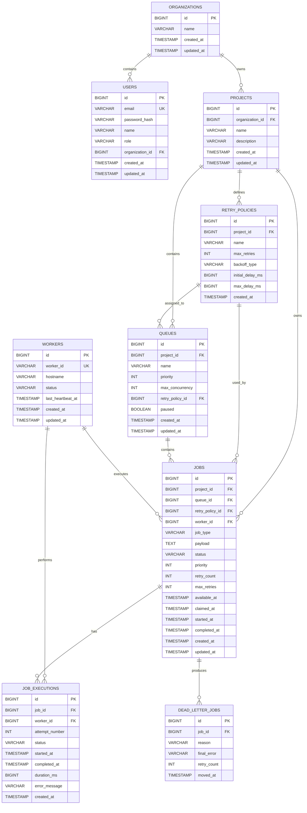

# Distributed Job Scheduler

A production-inspired distributed job scheduling platform for creating, queuing, executing, retrying, monitoring, and recovering asynchronous background jobs across multiple workers.

The system provides authentication, organization-level authorization, project and queue management, priority scheduling, concurrency control, configurable retry policies, worker monitoring, execution history, Dead Letter Queue (DLQ) handling, requeue support, and a full React dashboard.

---

## Features

* JWT authentication
* Signup, Login and Logout
* Organization-level resource ownership
* Project management
* Queue management
* Queue priority
* Queue concurrency limits
* Queue pause/resume
* Configurable retry policies
* Fixed, Linear and Exponential backoff
* Distributed worker execution
* Worker heartbeat monitoring
* Stale-job recovery
* Job lifecycle tracking
* Job execution history
* Retry tracking
* Dead Letter Queue
* DLQ requeue
* Queue statistics
* React dashboard
* Dockerized frontend and backend
* MySQL persistence
* Redis integration
* REST APIs
* Resource-level authorization

---

# System Architecture

```text
                              ┌───────────────────────┐
                              │        Browser        │
                              │     React Frontend    │
                              │        :5173          │
                              └───────────┬───────────┘
                                          │
                                     HTTP + JWT
                                          │
                                          ▼
                              ┌───────────────────────┐
                              │     Spring Boot       │
                              │        Backend        │
                              │         :8080         │
                              └───────────┬───────────┘
                                          │
                        ┌─────────────────┼─────────────────┐
                        │                 │                 │
                        ▼                 ▼                 ▼
                 ┌────────────┐   ┌────────────┐   ┌───────────────┐
                 │   MySQL    │   │   Redis    │   │    Workers    │
                 │   :3306    │   │   :6379    │   │               │
                 │            │   │            │   │   worker-1    │
                 │ Scheduler  │   │ Distributed│   │   worker-2    │
                 │ Database   │   │Coordination│   │      ...      │
                 └────────────┘   └────────────┘   └───────────────┘
```

### Docker Host Ports

| Service  | Host                  |
| -------- | --------------------- |
| Frontend | http://localhost:5173 |
| Backend  | http://localhost:8080 |
| MySQL    | localhost:3307        |
| Redis    | localhost:6380        |

### Docker Internal Networking

```text
backend → mysql:3306
backend → redis:6379
```

---

# Technology Stack

## Backend

```text
Java 21
Spring Boot
Spring Security
JWT
Spring Data JPA
Hibernate
Flyway
Maven
MySQL 8.4
Redis
```

## Frontend

```text
React 19
Vite
Axios
JavaScript
CSS
ESLint
```

## Infrastructure

```text
Docker
Docker Compose
Nginx
```

---

# Project Structure

```text
distributed-job-scheduler/
│
├── backend/
│   ├── src/
│   │   ├── main/
│   │   │   ├── java/
│   │   │   │   └── com/scheduler/backend/
│   │   │   │
│   │   │   └── resources/
│   │   │       └── db/
│   │   │           └── migration/
│   │   │
│   │   ├── Dockerfile
│   │   └── pom.xml
│   │
│   ├── target/
│   └── Dockerfile
│
├── frontend/
│   ├── src/
│   │   ├── api/
│   │   ├── pages/
│   │   ├── App.jsx
│   │   ├── App.css
│   │   └── index.css
│   │
│   ├── Dockerfile
│   ├── nginx.conf
│   ├── .dockerignore
│   ├── package.json
│   └── dist/
│
├── docker-compose.yml
└── README.md
```

---

# Database Structure

Main entities:

```text
organizations
users
projects
queues
retry_policies
jobs
job_executions
workers
dead_letter_jobs
```

---

# Entity Relationship Diagram



---

# Authorization Model

Protected resources follow this ownership chain:

```text
JWT User
    │
    ▼
Organization
    │
    ▼
Project
    │
    ▼
Queue
    │
    ▼
Job
    │
    ├── Execution History
    │
    └── Dead Letter Queue
```

This prevents users from accessing resources belonging to another organization.

---

# Authentication Flow

```text
Login
  │
  ▼
Email + Password
  │
  ▼
Spring Security Authentication
  │
  ▼
JWT Token
  │
  ▼
React localStorage
  │
  ▼
Axios Authorization Header
```

Example:

```http
Authorization: Bearer <JWT_TOKEN>
```

Login response:

```json
{
  "token": "...",
  "userId": 2,
  "organizationId": 1,
  "email": "test@example.com",
  "name": "Test User",
  "role": "USER"
}
```

---

# Job Lifecycle

## Successful Job

```text
PENDING
   │
   ▼
CLAIMED
   │
   ▼
RUNNING
   │
   ▼
SUCCESS
```

## Failed Job

```text
PENDING
   │
   ▼
CLAIMED
   │
   ▼
RUNNING
   │
   ▼
FAILED
   │
   ├──── Retry available ─────► PENDING
   │
   └──── Max retries reached ─► DLQ
```

---

# Worker Architecture

Workers are responsible for executing jobs asynchronously.

Example workers:

```text
worker-1
worker-2
```

Worker information:

```text
workerId
hostname
status
lastHeartbeatAt
createdAt
updatedAt
```

Workers periodically send heartbeat information:

```http
POST /api/workers/{workerId}/heartbeat
```

The scheduler uses heartbeat information to monitor worker health and recover stale jobs.

---

# Queue Scheduling

Each queue supports:

```text
Priority
Max Concurrency
Retry Policy
Pause / Resume
```

Example:

```text
Queue: limited-queue
Priority: 10
Concurrency: 1
Retry Policy: default-retry
Status: ACTIVE
```

Jobs are selected according to:

```text
Queue availability
Job status
Available time
Priority
Concurrency limit
```

---

# Retry Strategy

Retry policies contain:

```text
maxRetries
backoffType
initialDelayMs
maxDelayMs
```

Supported backoff types:

```text
FIXED
LINEAR
EXPONENTIAL
```

Example:

```text
Name:           default-retry
Max Retries:    3
Backoff Type:   EXPONENTIAL
Initial Delay:  2000 ms
Maximum Delay:  10000 ms
```

Retry flow:

```text
Attempt 1
   │
   ▼
Retry Delay
   │
   ▼
Attempt 2
   │
   ▼
Retry Delay
   │
   ▼
Attempt 3
   │
   ▼
DLQ
```

---

# Execution History

Every execution attempt is stored in `job_executions`.

Example:

```text
Job #37

Attempt 1
Status: FAILED
Worker: 1
Duration: 2 ms
Error: Simulated job failure

Attempt 2
Status: FAILED
Worker: 1
Duration: 2 ms
Error: Simulated job failure

Attempt 3
Status: FAILED
Worker: 1
Duration: 2 ms
Error: Simulated job failure
```

The dashboard displays:

```text
Attempt Number
Worker
Status
Started At
Completed At
Duration
Error Message
```

---

# Dead Letter Queue

When a job exceeds its maximum retry count, it is moved to the DLQ.

Example:

```text
Job #37
Status: FAILED
Retry Count: 3/3

Reason:
MAX_RETRIES_EXCEEDED

Final Error:
Simulated job failure
```

DLQ data:

```text
jobId
reason
finalError
retryCount
movedAt
```

---

# DLQ Requeue

Endpoint:

```http
POST /api/dlq/{id}/requeue
```

Requeue flow:

```text
DLQ
 │
 ▼
Job Status = PENDING
 │
 ▼
retryCount = 0
 │
 ▼
workerId = null
 │
 ▼
Worker Claims Job
 │
 ▼
Execution Starts Again
```

---

# Frontend Pages

## Dashboard

Displays:

* Project statistics
* Queue statistics
* Worker status
* DLQ count
* Job statistics
* Projects
* Queues
* Workers
* DLQ summary

## Projects

Supports:

* Project listing
* Project creation
* Organization ownership

## Queues

Supports:

* Queue listing
* Queue creation
* Priority
* Max concurrency
* Retry policy assignment
* Pause
* Resume
* Queue statistics

## Jobs

Supports:

* Project selection
* Queue selection
* Job creation
* Payload
* Priority
* Maximum retries
* Job status
* Retry count
* Worker information
* Job details
* Execution history
* Timeline

## Workers

Displays:

* Worker ID
* Hostname
* Status
* Last heartbeat
* Created time
* Updated time
* Online/offline statistics

## Retry Policies

Supports:

* Project selection
* Policy listing
* Policy creation
* Maximum retries
* Backoff type
* Initial delay
* Maximum delay

## Dead Letter Queue

Supports:

* Failed job listing
* Final error
* Retry count
* DLQ timestamp
* DLQ details
* Requeue

---

# API Endpoints

## Authentication

```http
POST /api/auth/register
POST /api/auth/login
```

## Projects

```http
POST /api/projects
GET  /api/projects?organizationId={organizationId}
GET  /api/projects/{id}
```

## Queues

```http
POST /api/queues
GET  /api/queues?projectId={projectId}
GET  /api/queues/{id}
PUT  /api/queues/{id}
POST /api/queues/{id}/pause
POST /api/queues/{id}/resume
GET  /api/queues/{id}/stats
```

## Retry Policies

```http
POST /api/retry-policies
GET  /api/retry-policies?projectId={projectId}
GET  /api/retry-policies/{id}
```

## Jobs

```http
POST /api/jobs
GET  /api/jobs?queueId={queueId}
GET  /api/jobs/{id}
GET  /api/jobs/{jobId}/executions
```

## Workers

```http
GET  /api/workers
POST /api/workers/{workerId}/heartbeat
POST /api/workers/{workerId}/jobs/{jobId}/execute
```

## Dead Letter Queue

```http
GET  /api/dlq
GET  /api/dlq/{id}
POST /api/dlq/{id}/requeue
```

## Health

```http
GET /actuator/health
```

---

# Running with Docker Compose

## Prerequisites

Install:

```text
Docker
Docker Compose
```

Verify:

```bash
docker --version
docker compose version
```

## Start the Complete Stack

```bash
cd ~/distributed-job-scheduler

docker compose up --build -d
```

## Check Containers

```bash
docker compose ps
```

Expected services:

```text
scheduler-mysql
scheduler-redis
scheduler-backend
scheduler-frontend
```

Example:

```text
NAME                 SERVICE    STATUS
scheduler-mysql     mysql       Up (healthy)
scheduler-redis     redis       Up (healthy)
scheduler-backend   backend     Up
scheduler-frontend  frontend    Up
```

---

# Application URLs

Frontend:

```text
http://localhost:5173
```

Backend:

```text
http://localhost:8080
```

Health Check:

```text
http://localhost:8080/actuator/health
```

Expected:

```json
{
  "groups": [
    "liveness",
    "readiness"
  ],
  "status": "UP"
}
```

---

# Docker Commands

Start:

```bash
docker compose up --build -d
```

Stop:

```bash
docker compose down
```

Check status:

```bash
docker compose ps
```

Backend logs:

```bash
docker compose logs backend --tail=100
```

Frontend logs:

```bash
docker compose logs frontend --tail=100
```

MySQL logs:

```bash
docker compose logs mysql --tail=100
```

Redis logs:

```bash
docker compose logs redis --tail=100
```

---

# Local Frontend Development

```bash
cd frontend

npm install
npm run dev
```

Frontend:

```text
http://localhost:5173
```

Lint:

```bash
npm run lint
```

Production build:

```bash
npm run build
```

Preview:

```bash
npm run preview
```

---

# Local Backend Development

```bash
cd backend

mvn clean package -DskipTests
```

Run backend:

```bash
mvn spring-boot:run
```

Backend:

```text
http://localhost:8080
```

---

# Example End-to-End Workflow

## Successful Job

```text
Login
  │
  ▼
Dashboard
  │
  ▼
Select Project
  │
  ▼
Select Queue
  │
  ▼
Create TEST_SUCCESS Job
  │
  ▼
PENDING
  │
  ▼
CLAIMED
  │
  ▼
RUNNING
  │
  ▼
SUCCESS
```

Example:

```text
Job #35
Status: SUCCESS
Worker: 1
Priority: 10
Retry Count: 0/3

Execution History
Attempt 1
Status: SUCCESS
Worker: 1
Duration: 104 ms
```

---

# Failure → Retry → DLQ

```text
Create TEST_FAIL Job
        │
        ▼
Attempt 1
        │
        ▼
FAILED
        │
        ▼
Retry
        │
        ▼
Attempt 2
        │
        ▼
FAILED
        │
        ▼
Retry
        │
        ▼
Attempt 3
        │
        ▼
FAILED
        │
        ▼
MAX_RETRIES_EXCEEDED
        │
        ▼
DLQ
```

Example:

```text
Job #37
Status: FAILED
Retry Count: 3/3

Attempt 1 → FAILED
Attempt 2 → FAILED
Attempt 3 → FAILED
```

---

# DLQ → Requeue Workflow

```text
Dead Letter Queue
        │
        ▼
Select Job
        │
        ▼
Requeue
        │
        ▼
Status = PENDING
        │
        ▼
retryCount = 0
        │
        ▼
workerId = null
        │
        ▼
Worker Claims Job
        │
        ▼
Execution Starts Again
```

---

# Testing

## Frontend Lint

```bash
cd frontend
npm run lint
```

## Frontend Production Build

```bash
npm run build
```

## Backend Build

```bash
cd backend
mvn clean package -DskipTests
```

## Backend Health Check

```bash
curl http://localhost:8080/actuator/health
```

## Docker Verification

```bash
docker compose ps
```

---

# Verified Functionality

## Authentication

```text
Signup                     ✅
Login                      ✅
Logout                     ✅
JWT Authentication         ✅
Organization Ownership     ✅
```

## Scheduler

```text
Job Creation               ✅
Job Claiming               ✅
Job Execution              ✅
Priority Scheduling        ✅
Queue Concurrency          ✅
Retry Policies             ✅
Execution History          ✅
```

## Reliability

```text
Worker Heartbeat           ✅
Worker Monitoring          ✅
Retry Handling             ✅
Stale Job Recovery         ✅
Dead Letter Queue          ✅
DLQ Requeue                ✅
```

## Frontend

```text
Dashboard                  ✅
Projects                   ✅
Queues                     ✅
Jobs                       ✅
Execution History          ✅
Workers                    ✅
Retry Policies             ✅
Dead Letter Queue          ✅
```

## Infrastructure

```text
Docker Frontend            ✅
Docker Backend             ✅
MySQL Container            ✅
Redis Container            ✅
Docker Compose             ✅
Production Frontend Build  ✅
ESLint                     ✅
```

---

# Complete System Flow

```text
                    ┌──────────────┐
                    │ React UI     │
                    │ Dashboard    │
                    └──────┬───────┘
                           │
                           ▼
                    ┌──────────────┐
                    │ Spring Boot  │
                    │ REST API     │
                    └──────┬───────┘
                           │
             ┌─────────────┼──────────────┐
             │             │              │
             ▼             ▼              ▼
          Projects       Queues         Jobs
                           │              │
                           ▼              ▼
                    Retry Policies     Workers
                                          │
                                          ▼
                                   Job Executions
                                          │
                       ┌──────────────────┴──────────────────┐
                       │                                     │
                       ▼                                     ▼
                    SUCCESS                                FAILED
                                                             │
                                                             ▼
                                                           Retry
                                                             │
                                                             ▼
                                                     Max Retries
                                                             │
                                                             ▼
                                                            DLQ
                                                             │
                                                             ▼
                                                          Requeue
                                                             │
                                                             ▼
                                                          Worker
```

---

# Project Goal

The system provides a reliable distributed background-job platform where jobs can be:

```text
created
  ↓
queued
  ↓
prioritized
  ↓
claimed
  ↓
executed
  ↓
retried on failure
  ↓
tracked through execution history
  ↓
moved to DLQ after retry exhaustion
  ↓
requeued for recovery
```

The project demonstrates:

```text
Distributed Scheduling
Concurrency Control
Asynchronous Job Execution
Retry Mechanisms
Exponential Backoff
Worker Health Monitoring
Failure Recovery
Dead Letter Queue
JWT Authentication
Organization-Level Authorization
Database Design
REST API Development
React Frontend
Dockerized Deployment
```

---

# Author

Distributed Job Scheduler project developed by Shantanu675 demonstrating backend engineering, distributed systems, reliability, API design, database design, and full-stack implementation.
